# OpenFlywheel

[](https://github.com/divo12/OpenFlyWheel/actions/workflows/ci.yml)


**Turn verifier-backed agent failures into isolated, evidence-bound harness experiments.**

OpenFlywheel connects benchmark outcomes, Langfuse traces, failure diagnosis, and Git worktrees
into one governed improvement loop. It helps a coding agent answer four questions before changing
another agent:

1. What objectively failed?
2. Where did the trajectory first become unrecoverable?
3. What is the smallest harness intervention supported by that evidence?
4. Did the isolated candidate improve without regressing previously working behavior?

It is designed for harness engineering, not prompt guessing. The benchmark and verifier remain
fixed, trace reads stay bounded, and each candidate receives an explicit edit allowlist.

> [!IMPORTANT]
> The current `fresh` release prepares and evaluates one isolated **ITSM-bench** candidate, then
> stops before admission. It includes a deterministic promotion-decision API, but automated
> publication and rollback are not yet wired into the released loop.

## How it works

```mermaid
flowchart LR
    A[Harbor baseline] --> B[Authoritative verifier outcomes]
    B --> C[Bounded Langfuse evidence]
    C --> D[Per-task failure diagnoses]
    D --> E[Cross-task failure patterns]
    E --> F[One causal harness hypothesis]
    F --> G[Isolated Git worktree]
    G --> H[Same frozen benchmark controls]
    H --> I[Evaluated candidate receipt]
    I --> J[Deterministic promotion decision]
```



The optimization agent never receives authority to rewrite the benchmark, verifier, model,
reasoning budget, or observability identity. A hypothesis names the exact component and paths it
may change; everything else is frozen.

## Why OpenFlywheel

Most agent-improvement loops fail in one of two ways:

- they optimize against anecdotes instead of authoritative outcomes; or
- they make several prompt, tool, and control-flow changes at once, making attribution impossible.

OpenFlywheel keeps the causal chain explicit:

```text
verifier result
  → trace evidence
  → earliest recoverable failure
  → repeated causal pattern
  → one localized intervention
  → one isolated candidate
  → same-task evaluation
```

This makes unsuccessful candidates useful. A rejected experiment still tells you which mechanism
or enforcement level to stop repeating.

## Core guarantees

### Verifier-first outcomes

An agent saying “done” is not success. OpenFlywheel records `pass`, `fail`, `abstain`, or `error`
only from an authoritative external verifier. Missing or ambiguous evidence remains unverified.

### Read-only trace retrieval

Langfuse is the source of truth for traces and spans. Structural trace tools use bounded pages,
opaque cursors, deterministic ordering, and GET-only provider access. Raw trace payloads are not
copied into a local database.

The only Langfuse write is an authoritative outcome score attached to the exact evaluated trace.

### Evidence-bound diagnosis

Failure mining works backward from the verifier mismatch to the earliest unrecovered observation
that could have changed the outcome. Diagnoses cite bounded observation IDs and can explicitly
remain inconclusive.

### Atomic candidate authority

Every hypothesis records:

- the causal mechanism and violated invariant;
- supporting diagnosis and pattern receipts;
- the harness component and exact editable paths;
- predicted task improvements;
- plausible regression risks; and
- an observable before/after effect.

Candidate work happens in a sibling Git worktree created from the accepted experiment commit.
Edits outside the hypothesis allowlist are rejected.

### Deterministic promotion gate

The promotion gate is a pure function over the experiment policy and two evaluated-run receipts.
It accepts only when:

- the task partition, controls, verifier, receipts, and Git identities match;
- no previously passing task regresses;
- at least one current non-pass becomes a pass; and
- configured cost and latency limits are satisfied with complete evidence.

Missing evidence produces an inconclusive decision rather than an accidental promotion.

## Current workflow

OpenFlywheel ships a Codex plugin with focused skills for each phase:

| Phase | Skill or tool | Result |
|---|---|---|
| Prepare | `$workspace-init` / `prepare_workspace` | Isolated branch, worktree, policy, `PROGRAM.md`, baseline |
| Select evidence | `$trace-query-planner` | Bounded trace and span observations |
| Record outcomes | `$outcome-recorder` / `record_outcome` | Authoritative Langfuse score receipt |
| Diagnose | `$failure-miner` / `record_failure` | Compact evidence-backed diagnosis |
| Find recurrence | `$failure-pattern-miner` | Exact normalized cross-task patterns |
| Curate | `$failure-curator` | Evidence-bound groups and deferred failures |
| Form intervention | `$hypothesis-former` / `record_hypothesis` | Immutable harness hypothesis |
| Evaluate | `execute_candidate` | Isolated commit and evaluated-run receipt |
| Decide | `decide_promotion` | Accept, reject, or inconclusive decision |

The generated `PROGRAM.md` is the experiment state machine. It defines the editable surface,
frozen controls, phase order, budgets, retry rules, and stopping boundary for the coding agent.

## Quickstart

### Requirements

- Python 3.11 or newer
- [uv](https://docs.astral.sh/uv/)
- Git
- a Langfuse project
- Harbor with an ITSM-bench task configuration
- an instrumented agent harness stored in a Git repository

### 1. Install the development environment

```bash
git clone --branch fresh https://github.com/divo12/OpenFlyWheel.git
cd OpenFlyWheel
uv sync --extra dev --extra plugin
```

### 2. Configure credentials

Keep credentials in environment variables. OpenFlywheel accepts OpenAI-compatible or Azure OpenAI
credentials and uses the Langfuse variables for trace access and outcome recording.

```bash
export OPENAI_API_KEY="..."
export OPENAI_BASE_URL="..."

export LANGFUSE_PUBLIC_KEY="..."
export LANGFUSE_SECRET_KEY="..."
export LANGFUSE_BASE_URL="..."
```

For Azure OpenAI, use `AZURE_OPENAI_API_KEY` and `AZURE_OPENAI_BASE_URL` instead of the two OpenAI
variables. Never commit these values.

### 3. Register the MCP server with Codex

From the repository root:

```bash
codex mcp add openflywheel -- \
  uv run --directory "$PWD" --extra plugin openflywheel-mcp
```

This exposes the typed OpenFlywheel tools. The guided skills and program templates live in
[`plugins/openflywheel`](plugins/openflywheel) and are included when that plugin is installed
through a Codex marketplace.

### 4. Prepare an experiment

With the plugin installed, start with:

```text
Use $workspace-init to prepare this agent harness for an ITSM-bench experiment.
```

The initializer inspects the harness, collects the experiment policy, creates an isolated
worktree, runs the baseline, and generates `PROGRAM.md`. When preparation returns `ready`, start a
fresh coding-agent session in the returned worktree:

```text
Read PROGRAM.md and start the optimization loop.
The baseline is already recorded. Start from step 2 (analyze failures).
```

The session will record baseline outcomes, diagnose failures, form one hypothesis, implement one
candidate in another isolated worktree, and evaluate the same task partition under frozen
controls.

## MCP tools

### Workspace and candidate lifecycle

- `prepare_workspace` — create or poll an isolated ITSM experiment and baseline.
- `execute_candidate` — create, seal, launch, or poll one hypothesis-bound candidate.

### Bounded Langfuse reads

- `list_traces` — list logical-root traces for one session and UTC range.
- `get_trace_schema` — skim trace structure without loading input or output.
- `query_spans` — select spans using typed structural filters.
- `get_span_context` — read one span with bounded parent and child context.

### Evidence and hypothesis records

- `record_outcome` — attach one authoritative verifier outcome to its exact trace.
- `record_failure` — persist one compact supported or inconclusive diagnosis.
- `mine_failure_patterns` — group diagnoses by exact normalized cause.
- `record_failure_curation` — persist complete cross-task grouping and deferrals.
- `record_hypothesis` — persist one localized, falsifiable intervention contract.

All external boundaries use strict Pydantic models. Domain values are immutable, identifiers and
sizes are bounded, and provider failures are converted into typed errors without leaking secrets.

## Promotion decisions

The current release exposes promotion as a Python API:

```python
from ofw.evolution.gate import decide_promotion

decision = decide_promotion(policy, accepted_run, candidate_run)

print(decision.status)   # accept | reject | inconclusive
print(decision.reasons)  # deterministic typed reasons
```

The gate does not run benchmarks, edit harnesses, or publish Git revisions. It only evaluates
already-authenticated policy and run receipts.

## Trust boundaries

| Boundary | Rule |
|---|---|
| Verifier | Sole authority for task correctness |
| Langfuse | Source of truth for trajectories, usage, cost, and latency |
| Local workspace | Stores compact receipts and diagnoses, never raw traces |
| Benchmark | Frozen and outside candidate edit authority |
| Harness candidate | May edit only hypothesis-approved paths |
| Git | Isolated worktrees and content identities make candidates auditable |
| Promotion gate | Pure decision logic; no filesystem, network, or provider I/O |

## Repository layout

```text
plugins/openflywheel/       Codex plugin, skills, MCP manifest, PROGRAM templates
src/ofw/evaluation/         Outcomes, diagnoses, curation, patterns, Langfuse score storage
src/ofw/evolution/          Hypotheses, candidate execution, Git isolation, promotion gate
src/ofw/observability/      Bounded read-only Langfuse trace gateway
src/ofw/preparation/        Experiment policy, Harbor runner, worktree preparation
src/ofw/mcp.py              Typed MCP protocol adapters
tests/                      Unit and integration coverage for the governed workflow
```

The main dependency direction is:

```text
MCP adapter → service → gateway → external provider
```

Services depend on gateway protocols rather than concrete HTTP clients. Trace retrieval remains
separate from judging, diagnosis, pattern mining, and candidate execution.

## Development

Install all development dependencies:

```bash
uv sync --extra dev --extra plugin
```

Run the same checks used for changes targeting `fresh`:

```bash
uv run ruff check src tests plugins/openflywheel/scripts/mcp_server.py
uv run mypy src tests plugins/openflywheel/scripts/mcp_server.py
uv run pytest --cov=ofw --cov-report=term-missing --cov-fail-under=90 -q
```

Validate the plugin package:

```bash
python3 ~/.codex/skills/.system/plugin-creator/scripts/validate_plugin.py \
  plugins/openflywheel
```

OpenFlywheel supports Python 3.11+ and keeps strict mypy clean. New modules are expected to retain
at least 90% coverage and changed functions should stay at cyclomatic complexity 5 or lower.

## Scope

OpenFlywheel currently targets **prepared ITSM-bench harness experiments**. It is not yet:

- a generic benchmark adapter framework;
- a hosted observability service;
- a replacement for Langfuse or Harbor;
- an automatic production deployment system; or
- an autonomous publisher of accepted harness changes.

Those boundaries are deliberate: evidence collection, harness mutation, evaluation, and
publication should earn trust independently.

## Contributing

Open an issue or pull request against `fresh`. Keep changes focused on one architectural concern,
include verifier-visible tests, preserve the trace and benchmark trust boundaries, and report exact
local verification commands and results.

Useful contributions include:

- additional bounded trace-query coverage;
- stronger diagnosis and hypothesis evaluation;
- safer benchmark adapters;
- clearer candidate attribution; and
- end-to-end tests that exercise real provider response contracts.

